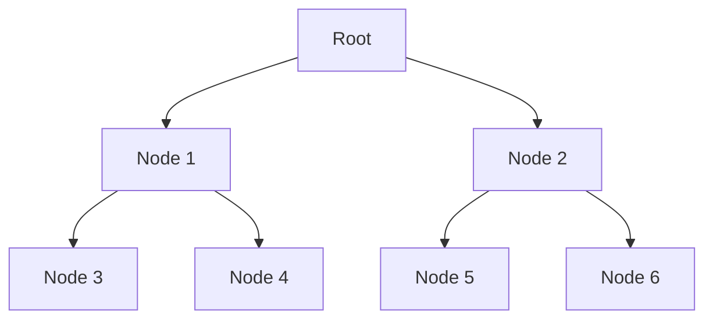
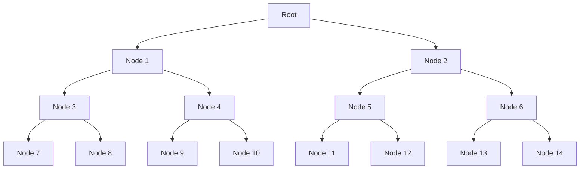

A data structure is a way to organise data in memory. Organisation makes data easier to process.

There are two types of data structures: linear and non-linear.

**Linear** - sequentially ordered in the memory
- Array
- Linked List
- Stack
- Queue

**Non Linear** - stored on multiple levels, hard to traverse all elements, not easy to implement
- Tree
- Graph

Why are linear data structures easier to traverse? See the below array:

Array -> 5, 9, 3, 10

You only need to loop through one element after another using something like a for loop.

Now look at a Tree:

You would need to first traverse through the nodes of node 1, then go back up the tree and traverse the nodes of node 2.

Introducing only just one more layer severely adds to the complexity, as seen above.