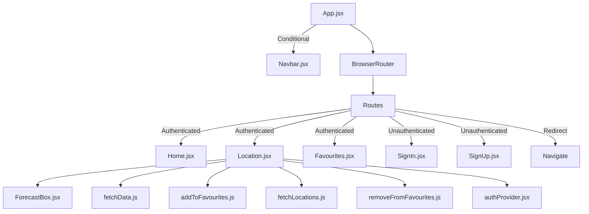

# User Stories
As a user I want to search for locations so that I can see its weather forecast.
As a user I want to see a 5-day forecast on a separate page once I have searched for a location so that I can see the forecast clearly.
As a user I want to sign up to the system so that I can save my favourite locations.
As a user I want to log in so that I can view my favourite locations.
As a user I I want to bookmark locations by clicking an icon so that I can revisit them at any time.
As a user I want to remove locations from my saved collection so that I can clear my list for new locations.
As a user I want to have access to a page where I can view and manage all of my saved locations.
As a user I want to be able to use the website on any screen size so that I can access the weather forecast when I am away from my laptop.
As a user I want to be denied entry to my account if my details are entered incorrectly.

