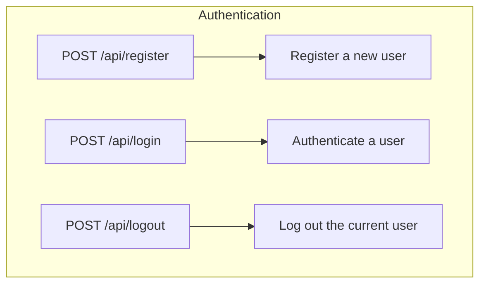
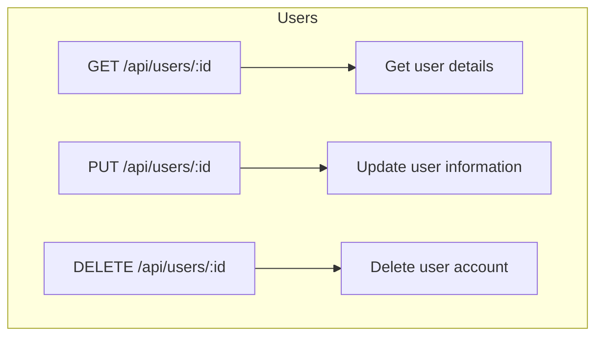
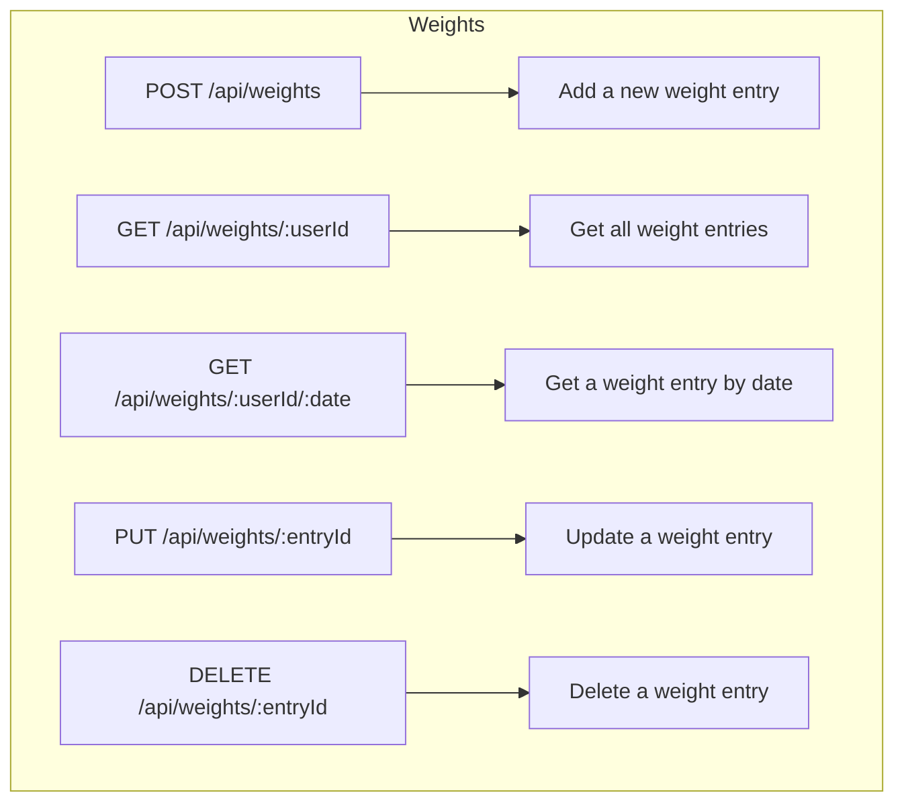
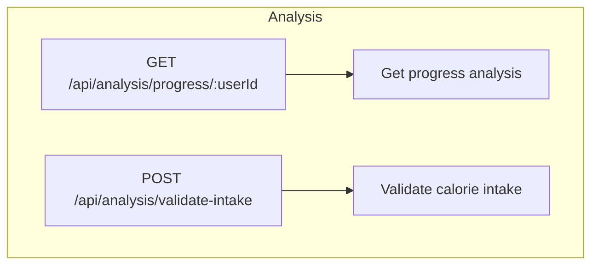

### Title
___
CalCount
### Description
___
At its core its a weight tracker. The difference is that I'm going to make the user experience so nice that it'll keep you coming back - and hopefully keep you on track. It will provide information such as graphs detailing your future progress at current trajectory, the ability to see how long it will take to get a certain weight depending on average calorie intake, and more features depending on how far I get.

### Meeting Requirements
___
1. **N-Tier Architecture**.- MongoDB database, Node & Express server, NextJS frontend.
2. **RESTful API** - see [[Challenge 6 Proposal#RESTful Routing]]
3. **Database** - MongoDB
4. **CRUD Operations** - see [[Challenge 6 Proposal#RESTful Routing]]
5. **Client-Side Application** - using React (through Next.js)
6. **User Interface** - Tailwind, Shadcn/UI, Airbnb Visx
7. **Authentication** - JWT, bcrypt etc. based on Ed's demo
8. **Authorization** - Admin & User role (admin can see all data)
9. **Testing** - Vitest, react-testing-library
10. **Deployment** - Vercel
11. **Documentation** - Kanban, set-up and testing tutorial, architecture diagrams, API route docs, review/retro in MD (docs folder)
### Features
___
- Full authentication to save data (JWT, bcrypt etc.)
- Input weight daily to add to a graph of your progress
- Analysis of future progress detailing things like time to a certain weight based on average calorie intake (highly configurable)
- Statistical analysis of weight loss compared to given calorie intake to infer the correctness of given calorie intake - used to ascertain validity of user estimates (not every meal can be tracked and that's fine because you'll get better over time)
### Context
___
Weight loss is hard. Consistency is key. I'm building an app that makes it easy to record your weight daily and provides motivating analysis based on your data. I've previously implemented this idea in Excel but I dropped off after a couple months because I didn't always have access to my laptop. This is meant for anyone who wants to have some way of tracking their journey that also wants to be informed of their progress in a bit of a nerdy way with cool infographics.

### Architecture
___
##### MongoDB Schema

```json
User document
{
  "_id": "ObjectId",
  "isAdmin": boolean,
  "username": "string",
  "password": "string",
  "email": "string",
  "shortTermGoal": "number", // kg
  "mediumTermGoal": "number", // kg
  "longTermGoal": "number", // kg
  "weightLog": [],
  "calorieLog": [],
  "createdAt": "date", // ISODate
  "updatedAt": "date", // ISODate
}

Weight document // goes in weightLog
{
  "weight": "number", // kg
  "notes": string,
  "createdAt": "date", // ISODate

}

calorieIntake document // goes in calorieLog
{
  "calories": "number", // kcal
  "notes": string,
  "createdAt": "date" // ISODate
}
```

### RESTful Routing
___
##### Authentication Routes


>[!info]
> **Authentication routes**
> 
> **POST /api/register** - Register a new user.
> - **Request Body**: `{ "username": "string", "password": "string" }`
> -  **Response**: `{ "message": "User registered successfully", "token": "JWT token" }`
> 
> **POST /api/login** - Authenticate a user.
>- **Request Body**: `{ "username": "string", "password": "string" }`
>-  **Response**: `{ "message": "User logged in successfully", "token": "JWT token" }`
> 
> **PUT /api/users/password/:id** - change password
> - **Parameters**: `id` (User ID)
>- **Request Body**: { "currentPassword": "string", "newPassword": "string" }
>- **Response:** 
>- *$Success$*: { "message": "Password updated successfully" }
>- $Error$: { "error": "Current password is incorrect" } if the current password provided doesn't match the user's current password.
>- Other appropriate error messages for validation or server errors.
>
>
> **POST /api/logout** - Log out the current user.
>- **Request Body**: `{ "token": "JWT token" }`
>- **Response**: `{ "message": "User logged out successfully" }`

##### User Routes



>[!info] **User routes**
> 
> **GET /api/users/:id - Get details of a specific user.**
> 
> - **Parameters**: `id` (User ID)
> - **Response**: `{ "username": "string", "email": "string", "createdAt": "date" }`
> 
> **PUT /api/users/:id - Update user information.**
> 
> - **Parameters**: `id` (User ID)
> - **Request Body**: `{ "username": "string", "email": "string" }`
> - **Response**: `{ "message": "User updated successfully" }`
> 
> **DELETE /api/users/:id -  Delete a user account.**
> 
> - **Parameters**: `id` (User ID)
> - **Response**: `{ "message": "User deleted successfully" }`





### Technologies
MERN core stack but using Next.js for the frontend rather than Vite. Benefits of Next are mainly for development purposes (I like the file-base routing). I will not be using Next.js for database access - the backend will be completely separate.

- Backend - Node.js, Express.js, MongoDB
- Frontend - Next.js (will "use client" on everything - won't bother with server components)
- UI - Airbnb Visx for infographics (https://airbnb.io/visx/gallery), TailwindCSS, Shadcn/ui for basic components (https://ui.shadcn.com)
- State management - I may need global state depending on how things get built out. I'm not quite sure yet. If I do I'll use zustand (https://github.com/pmndrs/zustand).
- Testing - Vitest, react-testing-library
### Deployment
I have used Vercel for deploying Next.js apps and it works perfectly (grabs source code fr GitHub). I believe it is also free to deploy hobby express apps on there so I will make an attempt at it. I've tried Fly.io once - nice CLI, heard good things about Render. All goes wrong I'll rent a cheap VM.
