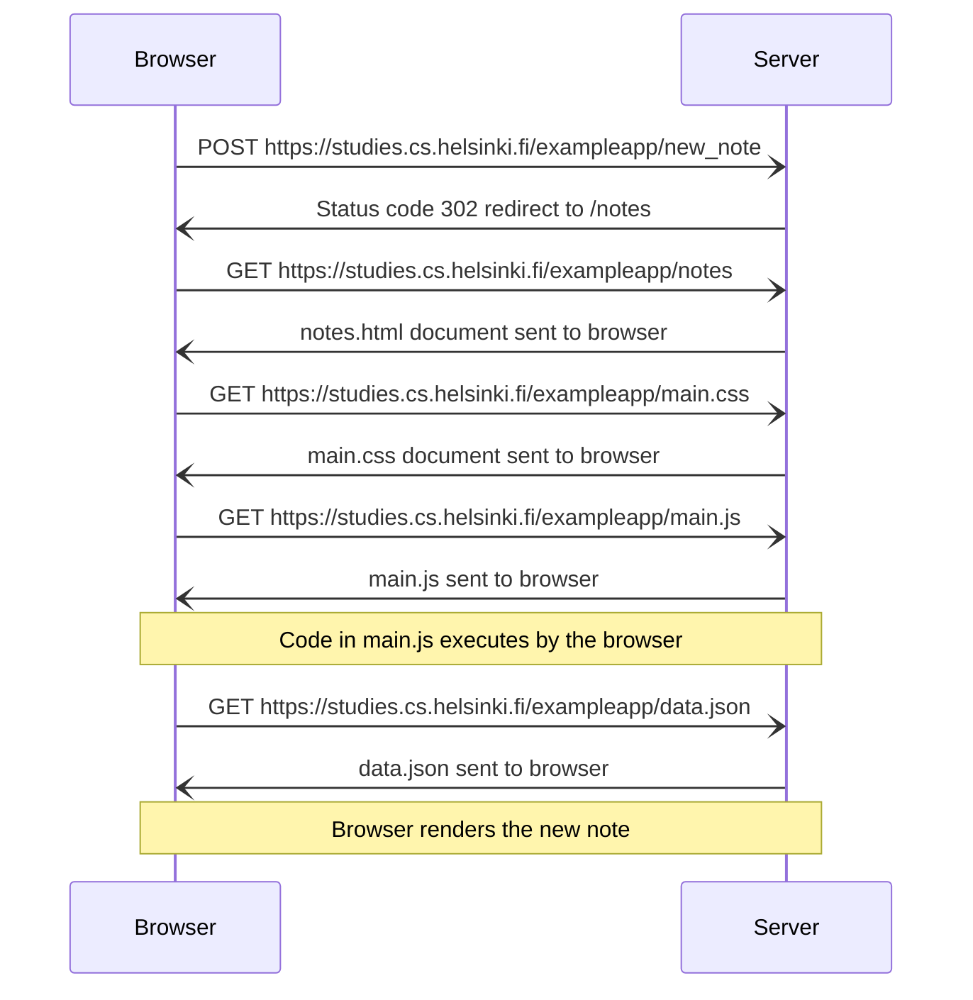

HTTP Status Code 200: Succesful HTTP Request

HTTP (GET) requests a URL first, then that URL will respond with a HTML document. Inside that HTML doc there may be an image tag with a source, in which case the browser will make a GET request for that image - the page is rendered before the image.

```js
var xhttp = new XMLHttpRequest()

xhttp.onreadystatechange = function() {
	if (this.readyState == 4 && this.status == 200) {
	    // code that takes care of the server response
	}
}

xhttp.open('GET', '/data.json', true)
xhttp.send()
```

The xhttp object sends a GET request to recieve the JSON file. When the state of the xhttp object changes, the function is invoked. xhttp state is defined by the property `XMLHttpRequest.readyState` and has 5 possible values ranging from `UNSENT` to `DONE`. 

This function is an event handler function, also called a `callback`. A Callback is invoked by the browser, not the application code, whenever the appropriate event occurs.

>[!tip]
>A callback is passed to another function
>This allows a function to call another function
>A callback can run after the function has finished

xhttp is an outdated version of `FETCH`. This part of the course doesn't want to get into `promises` yet so is using it for now.e

https://developer.mozilla.org/en-US/docs/Web/API/XMLHttpRequest/readyState

DOM:
```js
html
  head
    link
    script
  body
    div
      h1
      div
        ul
          li
          li
          li
      form
        input
        input
```

A POST request delivers a payload to a particular server address. The server responds with the HTTP status code 302 - a URL redirect, with which the server gets the browser to do a new GET request to the address defined in the header's Location.

```html
<form action="/exampleapp/new_note" method="POST">
      <input type="text" name="note"><br>
      <input type="submit" value="Save">
    </form>
```

*The action attribute defines the server address to which a POST payload will be sent (site/exampleapp/new-note). I assume the current page will just be reloaded as there is no mention of a different location.*

Redirect responses start with `3`, and a redirect works with thre `GET` HTTP request.

https://developer.mozilla.org/en-US/docs/Web/HTTP/Redirections

In JS, to redirect, use:

```js
window.location = "https://example.com/";
```

Accessing the payload data in the reciever of the POST request (the url/html doc) is with:
```js
req.body
```
*The `request` object has a body property, and in this case you can find the value of the request object's body's (the Note object) note property - I know kinda confusing.*

The Note obect has a content property and a date property.

There is no database in this example so new notes disappear on server restart.

This type of architecture is out of date. It is called AJAX (Asynchronous JavaScript and XML). It allows the website to fetch content to web pages using JavaScript written within the HTML, without re-rendeering the page.

Modern single-page applications (SPA) use the conventions of RESTful APIs. 

SPAs use one HTML document and simply use JavaScript for all interacitivity (changes dependent on user input).

An SPA still uses a POST request, but there is no action or method attribute in the form tag. The server responds with the status code 201 (new resource created). 

The JS code simply creates a new variable `form` using `document.getElementByID`, and on submission of the form (`form.onsubmit`), prevents the default handling of a form submission using `e.preventDefault()`, then does some things to bring the submission text onto the page.

```js
var form = document.getElementById('notes_form')
form.onsubmit = function(e) {
  e.preventDefault()

  var note = {
    content: e.target.elements[0].value,
    date: new Date(),
  }

  notes.push(note)
  e.target.elements[0].value = ''
  redrawNotes()
  sendToServer(note)
}
```

Here's the sentToServer code if you want it.

```js
var sendToServer = function(note) {
  var xhttpForPost = new XMLHttpRequest()
  // ...

  xhttpForPost.open('POST', '/new_note_spa', true)
  xhttpForPost.setRequestHeader('Content-type', 'application/json')
  xhttpForPost.send(JSON.stringify(note))
}
```

Again, this is all terrible practice and is just used to demonstrate the concepts of the course.


