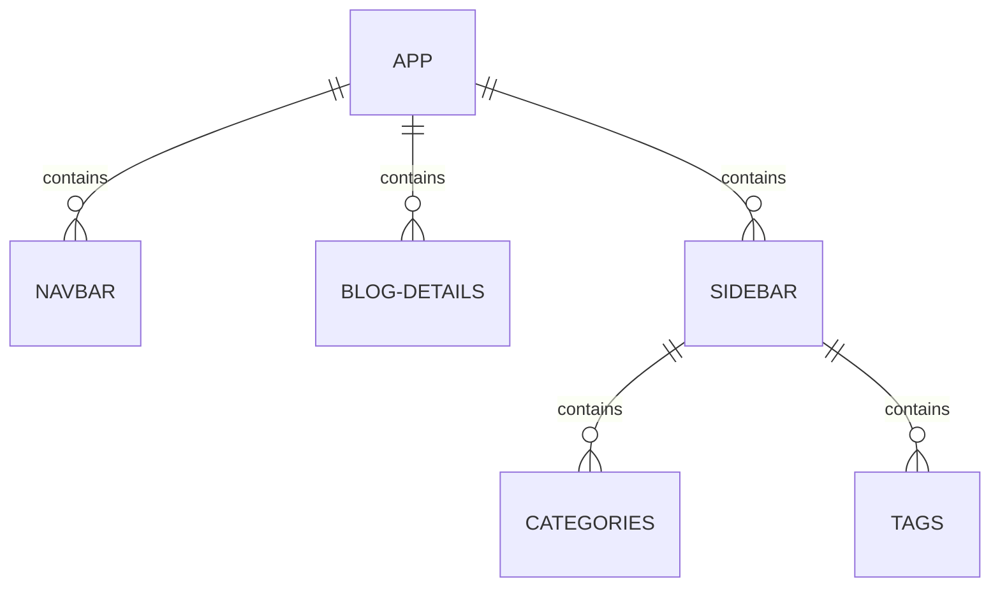

https://www.classcentral.com/course/youtube-full-modern-react-tutorial-45814/classroom

React helps create SPAs (Single Page Applications).

When a user clicks on a link, they are not then sent a separate html document. React will use JavaScript to update the Dom.

The new pages are loaded in really quickly - traditional multi-page applications are slower.

This tutorial involves making a mini micro blog using React.

Simple React Snippets - Burke Holland (vscode extension)

Vscode emmet settings need to be changed to allow their use in JSX (javascript, javascriptreact).

React  and Templates
___
A section of content:
e.g. navbar, articles, sidebar

Components contain:
- template (html)
- logic (javascript)

Add classes to divs in JSX:

```jsx
<div className="<name>"></div>
```

You don't need to import react into your components, just index.js.

Shortcut for a div with a class:

```jsx
<div className="App">
	//...
</div>
```

```emmet
.<class> + tab
```

Import the component into `index.js` using:

```js
import <Name> from './<Name>'
```

Then the React library renders everything in index.js.

A component is a function that must have a return , generally a JSX template. At the bottom we must export the component using:

```js
export default App;
```

Dynamic Values in Templating
___
Use curly braces to inject JavaScript variables into JSX:

```jsx
import './App.css'

function App() {
	const title = 'Welcome to the new blog';
	const likes = 50;

	return (
	<div className="App">
			<div className="content">
				<h1>{ title }</h1>
				<p> Liked { likes } time<p/>
			</div>
		</div>
	)
}

export default App;
```

*You can output any data-type apart from booleans and objects.

You can also just put the JavaScipt inside the curly braces:

```jsx
import './App.css'

function App() {
	const title = 'Welcome to the new blog';
	const likes = 50;
	const link = "http://www.google.com/"

	return (
	<div className="App">
			<div className="content">
				<h1>{ title }</h1>
				<p> Liked { likes } time</p>

				{/* <p>{ person }</p> */}

				<p> { 10 } </p>
				<p> { "hello, ninjas" }</p>
				<p> { [1,2,3,4,5] }</p>
				<p> { Math.random() * 10 }</p>
				
				<a href={link}></a>
			</div>
		</div>
	)
}

export default App;
```

You can use dynamic values as attributes in JSX tags:

```js
<a href={link}></a>
```

Multiple Components
___
Every component is nested within `App.js`. 


*Each component is as JavaScript file with a capitalised first letter*

>[!tip]
>Stateless Function Component Snippet:
`sfc`

Adding Styles
___
You can use css modules or styles components for better separation of concerns (Beyond the scope of this tutorial).

Dynamic Styling:
```jsx
style={{}}
```

*Nest curly braces inside curly braces*

```jsx
<div style={{
	color: 'white',
	backgroundColor: '#f1356d',
	borderRadius: '8px'
}}
</div>

// is the same as

const style1 = {
	color: 'white',
	backgroundColor: '#f1356d',
	borderRadius: '8px'
}
...
<div style={style1}>
</div>
```

Click Events
___
Write a function (e.g. handleClick) for what happens on a click, then add `onClick={handleClick}`.

```jsx
const Home = () => {

	const handleClick = () => {
		console.log("Hello ninjas!")
	}
	
	return (
		<div className="home">
			<h2>HomePage</h2>
			<button onClick={handleClick}>Click me</button>
		</div>
	)
}

export default Home;
```

>[!warning]
>Note that the handleClick function is not appended with parentheses, and is therefore not invoked until after a click. If it had parentheses, the function would run when the page loads.

Pass Functions to Event Handlers
___
You need to create an anonymous function inside the `onClick`. This will execute any function within the anonymous function once the click is registered.

```jsx
const Home = () => {

  const handleClickAgain = (name) => {
    console.log(`Hello ` + name)
  }
  return (
    <div className="home">
      <h2>HomePage</h2>
      <button onClick={handleClick}>Click me</button>
      <button onClick={() => handleClickAgain("Mario")}>Click me
      again</button>
    </div>
  );
}

export default Home;
```

Adding to what we had before:

```jsx
const Home = () => {

  const handleClick = () => {
    console.log("Hello ninjas!")
  }

  const handleClickAgain = (name) => {
    console.log(`Hello ` + name)
  }

  return (
    <div className="home">
      <h2>HomePage</h2>
      <button onClick={handleClick}>Click me</button>
      <button onClick={() => {
        handleClickAgain("Mario")
      }}>Click me again</button>
    </div>
  );
}

export default Home;
```

Using Event Objects
___
Just add e:

```jsx
const Home = () => {

  const handleClick = (e) => {
    console.log("Hello ninjas!", e)
  }

  const handleClickAgain = (name, e) => {
    console.log(`Hello ` + name, e.target)
  }

  return (
    <div className="home">
      <h2>HomePage</h2>
      <button onClick={handleClick}>Click me</button>
      <button onClick={(e) => handleClickAgain("Mario", e)}>Click me again</button>
    </div>
  );
}

export default Home;```

![[Pasted image 20230130143503.png]]

Using (useState hook)
___

State = data being used by component at that point in kind (any data-type).

The following code will output Mario instead of Luigi in a paragraph.

```jsx
const Home = () => {
  let name = "Mario";

  const handleClick = () => {
    name = "luigi";
    console.log(name);
  }

  return (
    <div className="home">
      <h2>HomePage</h2>
      <p>{ name }</p>
      <button onClick={handleClick}>Click me</button>
    </div>
  );
}

export default Home;```

![[Pasted image 20230130170512.png]]

If you want to change your variable dynamically in some part of your code, and then use it in your return JSX, then you have to make that variable *reactive*.

A `hook` is a special type of function prepended by the prefix `use`.

First, import the `useState` hook:

```js
import { useState } from 'react';
```

Then declare an array destructured variable:

```jsx
const [name, setName] = useState("Mario");
```

>[!info]
>The first parameter `name` (in the array) is the default value, the second parameter `setName` is a function which can be used to change the value.

You can then add the `setName` function to your event handler function:

```jsx
  const handleClick = () => {
    setName("Luigi");
...
}
  ```

Now on a click Mario will change to Luigi:

```jsx
import { useState } from 'react';

const Home = () => {
  // let name = "Mario";
  const [name, setName] = useState("Mario");

  const handleClick = () => {
    setName("Luigi");
  }

  return (
    <div className="home">
      <h2>HomePage</h2>
      <p>{ name }</p>
      <button onClick={handleClick}>Click me</button>
    </div>
  );
}

export default Home;
```

![[Pasted image 20230130171243.png]]

>[!tip]
>There is a useState snippet that will give you the code - just type the name of the piece of data you want to make reactive, then tab, and write the default value.

![[Pasted image 20230130171621.png]]

Outputting Lists
___
If you want to dynamically change an array, then use the `.map()` function inside your return.

```jsx
import { useState } from 'react';

const Home = () => {
  const [blogs, setBlogs] = useState([
    { title: 'My new website', body: 'lorem ipsum...', author: 'mario', id: 1 },
    { title: 'Welcome party!', body: 'lorem ipsum...', author: 'yoshi', id: 2 },
    { title: 'Web dev top tips', body: 'lorem ipsum...', author: 'mario', id: 3 }
  ]);

  return (
    <div className="home">
      {blogs.map((blog) => (
        <div className="blog-preview" key={blog.id}>
          <h2>{ blog.title }</h2>
          <p>Written by { blog.author }</p>
        </div>
      ))}
    </div>
  );
}

export default Home;```

>[!warning]
>You must include a uniqie key in the root element of your return

Props
___
If you want to pass data from one file to a component from another file that is being used in the current file, then you need to use props.

You can also just put the data in the other component file, but by using props you have some advantages:

- Components become more reusable as they don't have default data
- You can keep data in more places than just the component file

Props are a way to pass data from a parent component to a child component.

In the below example, we've moved the JSX of the return into a separate compnent called `BlogList`:

```jsx
//BlogList.js
const BlogList = (props) => {
  const blogs = props.blogs;

  console.log(props,blogs);
  return (
    <div className="blog-list">
      {blogs.map((blog) => (
        <div className="blog-preview" key={blog.id}>
          <h2>{ blog.title }</h2>
          <p>Written by { blog.author }</p>
        </div>
      ))}
    </div>
  );
}

export default BlogList;
```

```js
//Home.js
import { useState } from 'react';
import BlogList from './BlogList';

const Home = () => {
  const [blogs, setBlogs] = useState([
    { title: 'My new website', body: 'lorem ipsum...', author: 'mario', id: 1 },
    { title: 'Welcome party!', body: 'lorem ipsum...', author: 'yoshi', id: 2 },
    { title: 'Web dev top tips', body: 'lorem ipsum...', author: 'mario', id: 3 }
  ]);

  return (
    <div className="home">
      <BlogList blogs={blogs}/>
    </div>
  );
}

export default Home;```

>[!info]
>The array of objects, `blogs` is being passed to the BlogList component through the use of a property (`prop`) name `blogs`:
>```jsx
>BlogList blogs={blogs}
>```
>The child component `BlogList`, in a separate JS file, receives this data as props. Each prop has a name, in this case `blogs`. Therefore the data for this prop can be used by typing `props.blogs` 

`props` is an argument for the BlogList component's function. There is a particular prop `blogs` declared in the return of the app component, which is then used inside the BlogList component.

You can also destructure the JavaScript in your child component as such:

```jsx
//BlogList.js
const BlogList = ({ blogs, title }) => {
  // const blogs = props.blogs;
  // const title = props.title;

  return (
    <div className="blog-list">
      <h2>{ title }</h2>
      {blogs.map((blog) => (
        <div className="blog-preview" key={blog.id}>
          <h2>{ blog.title }</h2>
          <p>Written by { blog.author }</p>
        </div>
      ))}
    </div>
  );
}

export default BlogList;```

*The commented out lines are no longer needed* (they are automatically done for you).

Reusing Components
___
You can filter out certain data in order to reuse components.

```jsx
<BlogList blogs={blogs.filter((blog) => blog.author === 'mario')} title="Mario's Blogs"/>
```

`.filter()` fires a callback function for each item in the array. If they callback is true for an item, it keeps it in the array, and if it returns false it is removed. the end result is a new array that is returned.

Functions as Props (Deleting Component Parts)
___
You can pass functions as props.

```jsx
//home.js
import { useState } from 'react';
import BlogList from './BlogList';

const Home = () => {
  const [blogs, setBlogs] = useState([
    { title: 'My new website', body: 'lorem ipsum...', author: 'mario', id: 1 },
    { title: 'Welcome party!', body: 'lorem ipsum...', author: 'yoshi', id: 2 },
    { title: 'Web dev top tips', body: 'lorem ipsum...', author: 'mario', id: 3 }
  ]);

  const handleDelete = (id) => {
    const newBlogs = blogs.filter(blog => blog.id !== id)
    setBlogs(newBlogs);
  }

  return (
    <div className="home">
      <BlogList blogs={blogs} title="All Blogs" handleDelete={handleDelete}/>
    </div>
  );
}

export default Home;
```

```jsx
//BlogList.js
const BlogList = ({ blogs, title, handleDelete }) => {
  // const blogs = props.blogs;
  // const title = props.title;

  return (
    <div className="blog-list">
      <h2>{ title }</h2>
      {blogs.map((blog) => (
        <div className="blog-preview" key={blog.id}>
          <h2>{ blog.title }</h2>
          <p>Written by { blog.author }</p>
          <button onClick={() => handleDelete(blog.id)}>delete blog</button>
        </div>
      ))}
    </div>
  );
}

export default BlogList;
```

useEffect Hook Basics
___
Runs a function on every render of the component (including on the initial load).

Every time the state changes, useEffect executes a function.

Just go (not in the return, but within the component function):
```jsx
useEffect(() => {
...
...
})
```

Here is the full code:

```jsx
//Home.js
import { useState, useEffect } from 'react';
import BlogList from './BlogList';

const Home = () => {
  const [blogs, setBlogs] = useState([
    { title: 'My new website', body: 'lorem ipsum...', author: 'mario', id: 1 },
    { title: 'Welcome party!', body: 'lorem ipsum...', author: 'yoshi', id: 2 },
    { title: 'Web dev top tips', body: 'lorem ipsum...', author: 'mario', id: 3 }
  ]);

  const handleDelete = (id) => {
    const newBlogs = blogs.filter(blog => blog.id !== id)
    setBlogs(newBlogs);
  }

  useEffect(() => {
    console.log("use effect ran");
    console.log(blogs);
  })

  return (
    <div className="home">
      <BlogList blogs={blogs} title="All Blogs" handleDelete={handleDelete}/>
    </div>
  );
}

export default Home;
```

```jsx
//BlogList.js
const BlogList = ({ blogs, title, handleDelete }) => {
  // const blogs = props.blogs;
  // const title = props.title;

  return (
    <div className="blog-list">
      <h2>{ title }</h2>
      {blogs.map((blog) => (
        <div className="blog-preview" key={blog.id}>
          <h2>{ blog.title }</h2>
          <p>Written by { blog.author }</p>
          <button onClick={() => handleDelete(blog.id)}>delete blog</button>
        </div>
      ))}
    </div>
  );
}

export default BlogList;
```

useEffect Dependencies (Dependency Arrays)
___
Used to limit the running of useEffect functions.

Pass an array into a useEffect hook as a second argumeny (comma after the functions to be executed on render of the the component).

Empty array will only run the function on the initial render:

```jsx
  useEffect(() => {
    console.log("use effect ran");
    console.log(blogs);
  }, []);
  ```

If you want the function to run only if a particular state changes, then add that state to the array.

```jsx
  useEffect(() => {
    console.log("use effect ran");
    console.log(name);
  }, [name]);
  ```

Essentially you can add a second argument to a useEffect function that is an array containing the variables that we want to cause the useEffect function to run.

>[!tip]
>If a variable in the array changes, the function will run.

Using JSON Server
___
useEffect can be use to fetch data. In this case, JSON data.

```bash
npx json-server --watch data/db.json -- port 8000
```

Use this to start a fake rest API server. This will watch the json file and wrap it with some endpoints (resources, home):

![[Pasted image 20230130224543.png]]

Endpoints for the Fake Server:

| URL         | Method | Action              |
| ----------- | ------ | ------------------- |
| /blogs      | GET    | Fetch all blog      |
| /blogs/{id} | GET    | Fetch a single blog |
| /blogs      | POST   | Add a new blog      |
| /blogs/{id} | DELETE | Delete a blog       |

Fetching Data with useEffect
___
Get the data from the JSON and set the `blogs` variable to be the data we get from it:

```jsx
  useEffect(() => {
    fetch('http://localhost:8000/blogs')
    .then(res => {
      return res.json()
    })
    .then(data => {
      setBlogs(data)
    })
  }, []);
  ```

FInal code that fetches data from JSON and outputs it to the DOM:

```jsx
import { useState, useEffect } from 'react';
import BlogList from './BlogList';

const Home = () => {
  const [blogs, setBlogs] = useState(null);

  useEffect(() => {
    fetch('http://localhost:8000/blogs')
    .then(res => {
      return res.json()
    })
    .then(data => {
      console.log(data)
      setBlogs(data)
    })
  }, []);

  return (
    <div className="home">
      {blogs && <BlogList blogs={blogs} title="All Blogs"/>}
    </div>
  );
}

export default Home;
```

>[!warning]
>We must use `blogs &&` in order that the return only be rendered when the variable `blogs` is not null. On the initial page load, `blogs` is null, and the useEffect takes a short amount of time to execute, so this must be taken into account.

The above ampersand method is how we do conditional templating in React. If the left side of the statement is falsy it doesn't bother with the right-hand side of the statement. Once the left evaluates as true, it then moves to the right:

```jsx
{blogs && <BlogList blogs={blogs} title="All Blogs" handleDelete={handleDelete}/>}
```

Conditional Loading Message
___
Create another piece of state (reactive variable) in the desired component (page).

Then refer to that reactive variable in your useEffect and your return.

Loading Example:

Create reactive variable:
```jsx
const [isPending, setIsPending] = useState(true);
```

Update the state of the reactive variable when appropriate:
```jsx
  useEffect(() => {
    fetch('http://localhost:8000/blogs')
    .then(res => {
      return res.json()
    })
    .then(data => {
      setBlogs(data);
      setIsPending(false);
    })
  }, []);
```

Reference the variable in your return:

```jsx
  return (
    <div className="home">
      {isPending && <div>Loading...</div>}
      {blogs && <BlogList blogs={blogs} title="All Blogs"/>}
    </div>
  );
```

To have a delay, use `setTimeout()`:

```jsx
  useEffect(() => {
    setTimeout(() => {
      fetch('http://localhost:8000/blogs')
      .then(res => {
        return res.json()
      })
      .then(data => {
        setBlogs(data);
        setIsPending(false);
      })
    }, 1000);
  }, []);```
  *Wrap your function in the setTimeout then give it a time in milliseconds as its second argument*

Handling Fetch Errors
___
Bit more effort.

1. Create an error variable, set to null
2. Make an if statement to throw an error if the fetch response is not okay
3. If the fetch is okay then set pending to false and error to null
4. If the fetch is not okay then catch the error and set the error variable to the err.message (remember to also make pending false)

```jsx
import { useState, useEffect } from 'react';
import BlogList from './BlogList';

const Home = () => {
  const [blogs, setBlogs] = useState(null);
  const [isPending, setIsPending] = useState(true);
  const [error, setError] = useState(null);

  useEffect(() => {
    setTimeout(() => {
      fetch('http://localhost:8000/blogs')
      .then(res => {
        if(!res.ok) {
          throw Error('Could not fetch the data for that resource')
        }
        return res.json()
      })
      .then(data => {
        setBlogs(data);
        setIsPending(false);
        setError(null);
      })
      .catch(err => {
        setIsPending(false);
        setError(err.message);
      })
    }, 200);
  }, []);

  return (
    <div className="home">
      { error && <div>{ error }</div>}
      {isPending && <div>Loading...</div>}
      {blogs && <BlogList blogs={blogs} title="All Blogs"/>}
    </div>
  );
}

export default Home;
```

Making a Custom Hook
___
You can turn all that fetch/error code into a custom hook for reusability.

This is how you can externalise logic from a component.


1. Create a `useSomething.js` file
2. Put all the logic inside (change `blog`) to `data` for reusability
3. Set the fetch parameter to a variable `url` instead of an actual url (so you can use different urls in different components)
4. Return all the reactive variables athe the end of your use function
5. Export default useFetch (useWhatever you've named it)

```jsx
//useEffect.js
import { useState, useEffect } from 'react';

const useFetch = (url) => {
  const [data, setData] = useState(null);
  const [isPending, setIsPending] = useState(true);
  const [error, setError] = useState(null);

  useEffect(() => {
    setTimeout(() => {
      fetch(url)
      .then(res => {
        if(!res.ok) {
          throw Error('Could not fetch the data for that resource')
        }
        return res.json();
      })
      .then(data => {
        setData(data);
        setIsPending(false);
        setError(null);
      })
      .catch(err => {
        setIsPending(false);
        setError(err.message);
      })
    }, 200);
  }, []);

  return { data, isPending, error }
}

export default useFetch
```

```jsx
//Home.js
import { useState, useEffect } from 'react';
import BlogList from './BlogList';
import useFetch from './useFetch';

const Home = () => {
  const { data:blogs, isPending, error } = useFetch('http://localhost:8000/blogs');

  return (
    <div className="home">
      {error && <div>{ error }</div>}
      {isPending && <div>Loading...</div>}
      {blogs && <BlogList blogs={blogs} title="All Blogs"/>}
    </div>
  );
}

export default Home;
```

The React Router
___
Install the React Router Library (this version for the tutorial):

```bash
npm install react-router-dom@5
```

Go to the root component (`App.js`) and add the following:

```bash
import { BrowserRouter as Router, Route, Switch } from 'react-router-dom';
```

Surround the entire application with the Router component so that all components have access to the router:

```jsx
import Navbar from './Navbar'
import Home from './Home'
import { BrowserRouter as Router, Route, Switch } from 'react-router-dom';


function App() {
	return (
    <Router>
      <div className="App">
        <Navbar />
        <div className="content">
          <Switch>
            <Route path="/">
              <Home />
            </Route>
          </Switch>
        </div>
      </div>
    </Router>
	)
}

export default App;

```

*All of our components go inside the `Switch` component*

This section of code details which components go where. The navbar is always visible, and anything inside the `Switch` component is only visible depending on which path the browser is on.

Exact Match Routes
___
Anything from "/" onwards in a url input to a browser will be matched by React with the first path that contains part of that url section (e.g. if you type in '/create', it will actually send you the return for "/" as they both contain "/", and the Home route comes first in the example below).

We stop this happening by using the `exact` prop.

```jsx
<Switch>
<Route exact path="/">
  <Home />
</Route>
<Route path="/create">
  <Create />
</Route>
</Switch>
```

Router Links
___
We use a special link tag to get React to stop the browser sending a request to the server. This will speed up the application.

Using the following, React will handle requests directly in the browser and intercept requests for new pages.

```js
import { Link } from 'react-router-dom'
```

Example Link:
```jsx
<Link to="/">Home</Link>
```
*Instead of `<a href="/">Home</a>`*

Full Code:

```jsx
import React from 'react'
import { Link } from 'react-router-dom'

const Navbar = () => {
  return (
    <nav className="navbar">
      <h1>The Dojo Blog</h1>
      <div className="links">
        <Link to="/">Home</Link>
        <Link to="/create">New Blog</Link>
      </div>
    </nav>
  );
}

export default Navbar;
```

useEffect Cleanup
___
A fetch tries to update a component when it completes, but if you switch to a different page before fetch completion, then the component will no longer be in the DOM. You will then get an error (can't perform React state update on an unmounted component).

You can combat this:

1. Declare an AbortController() to a constant in your useEffect:

```jsx
const abortCont = new AbortController();
```

2. Add a second argument to your fetch:

```jsx
fetch(url, { signal : abortCont.signal })
```

3. Return the following to abort a fetch:

```jsx
return () => abortCont.abort().
```

4. Make sure not to change state if we are in fact aborting:

```jsx
      .catch(err => {
        if (err.name === 'AbortError') {
          console.log('fetch aborted')
        } else {
          setIsPending(false);
          setError(err.message);
        }
```

Full Code:

```jsx
//useFetch.js
import { useState, useEffect } from 'react';

const useFetch = (url) => {
  const [data, setData] = useState(null);
  const [isPending, setIsPending] = useState(true);
  const [error, setError] = useState(null);

  useEffect(() => {
    const abortCont = new AbortController();

    setTimeout(() => {
      fetch(url, { signal : abortCont.signal })
      .then(res => {
        if(!res.ok) {
          throw Error('Could not fetch the data for that resource')
        }
        return res.json();
      })
      .then(data => {
        setData(data);
        setIsPending(false);
        setError(null);
      })
      .catch(err => {
        if (err.name === 'AbortError') {
          console.log('fetch aborted')
        } else {
          setIsPending(false);
          setError(err.message);
        }
      })
    }, 200);

    return () => abortCont.abort()
  }, [url]);

  return { data, isPending, error }
}

export default useFetch
```

I actually didn't have the unmounted component error in my app, so maybe this has been updated by React.

Route Parameter
___
Sometimes we need to pass dynamic values as part of the route. 

(Changeable routes that give you the same page).

Examples:
`/blogs/123`
`/blogs/456`
`/blog/789`

The BlogDetails component is rendered in all cases, but with the data of particular blogs in each case.

The number part of the url is an example of a route parameter.

1. Make the BlogDetails.js file
2. Add a new Router component to App.js:

```jsx
...
import BlogDetails from './BlogDetails';
...
...
<Route path="/blogs/:id">
  <BlogDetails />
</Route>
```

*Note that the route parameter is defined using a colon*

3. Make a constant as below to get the id

```jsx
//BlogDetails
import React from 'react'
import { useParams } from 'react-router-dom';

const BlogDetails = () => {
  const { id } = useParams();

  return (
    <div className="blog-details">
      <h2>Blog details - { id }</h2>
    </div>
  );
}

export default BlogDetails;
```

4. Add a link somewhere:

```jsx
//BlogList.js
...
  <Link to={`/blogs/${blog.id}`}>
	<h2> {blog.title }</h2>
	<p>Written by { blog.author }</p>
  </Link>
```

Reusing Custom Hooks
___
1. Add a reactive variable with the names of the data point you want to fetch
2. Use the data points in your return

```jsx
BlogDetails
import React from 'react'
import { useParams } from 'react-router-dom';
import useFetch from './useFetch';

const BlogDetails = () => {
  const { id } = useParams();
  const { data:blog , error, isPending} = useFetch(`http://localhost:8000/blogs/${id}`)

  return (
    <div className="blog-details">
      { isPending && <div>Loading...</div> }
      { error && <div>{ error }</div> }
      { blog && (
        <article>
          <h2>{ blog.title }</h2>
          <p>Writen by { blog.author }</p>
          <div>{ blog.body }</div>
        </article>
      )}
    </div>
  );
}

export default BlogDetails;

```

>[!info]
>- Think of a ***hook*** as a function that performs an action, a state
>- Think of the ***state*** as a built-in React object that is used to contain data or information about the component. A component's state can change over time; whenever it changes, the component re-renders.
>- State is contained within reactive variables written as destructured variable declarations (see above)

Controlled Inputs (Forms)
___
The input field should always be in-sync with the state.

Track inputs with the below code.

1. Create some state to track inputs:

```jsx
const [title, setTitle] = useState("");
```

3. Give the data (`title` in this case) to the input field, and use `onChange` to track the content of the input field:

```jsx
value={title}
onChange={(e) => setTitle(e.target.value)}
```

Full Code:

![[Pasted image 20230131191824.png]]

```jsx
//Create.js
import React from 'react'
import { useState } from 'react'

const Create = () => {
  const [title, setTitle] = useState("");
  const [body, setBody] = useState("");
  const [author, setAuthor] = useState("mario");

  return (
    <div className="create">
      <h2>Add a New Blog</h2>
      <form>
        <label>Blog title</label>
        <input
          type="text"
          required
          value={title}
          onChange={(e) => setTitle(e.target.value)}
        />
        <label>Blog body</label>
        <textarea
          required
          value={body}
          onChange={(e) => setBody(e.target.value)}
        ></textarea>
        <label>Blog author: </label>
        <select
        value={author}
        onChange={(e) => setAuthor(e.target.value)}
        >
          <option value="mario">mario</option>
          <option value="luigi">luigi</option>
        </select>
        <button>Add Blog</button>
        <p>{ title }</p>
        <p>{ body }</p>
      </form>
    </div>
  );
}

export default Create;
```

Submit Events
___
Create a custom handler function:
```jsx
const handleSubmit = (e) => {
e.preventDefault();
const blog = { title, body, author }
console.log(blog)
}
```

Submit forms using the custom function:

```jsx
<form onSubmit={handleSubmit}>
```

Full code:

```jsx
//Create.js
import React from 'react'
import { useState } from 'react'

const Create = () => {
  const [title, setTitle] = useState("");
  const [body, setBody] = useState("");
  const [author, setAuthor] = useState("mario");

  const handleSubmit = (e) => {
    e.preventDefault();
    const blog = { title, body, author }
    console.log(blog)
  }

  return (
    <div className="create">
      <h2>Add a New Blog</h2>
      <form onSubmit={handleSubmit}>
        <label>Blog title</label>
        <input
          type="text"
          required
          value={title}
          onChange={(e) => setTitle(e.target.value)}
        />
        <label>Blog body</label>
        <textarea
          required
          value={body}
          onChange={(e) => setBody(e.target.value)}
        ></textarea>
        <label>Blog author: </label>
        <select
        value={author}
        onChange={(e) => setAuthor(e.target.value)}
        >
          <option value="mario">mario</option>
          <option value="luigi">luigi</option>
        </select>
        <button>Add Blog</button>
        <p>{ title }</p>
        <p>{ body }</p>
      </form>
    </div>
  );
}

export default Create;
```

Making a POST request
___
Once a form has been created and objects are created when a form is submit, you need to make a POST request.

To make a POST request, use the following where needed (e.g. in the handleSubmit function):

```jsx
fetch('http://localhost:8000/blogs'), {
	method: "POST",
	headers: { "Content-Type": "application/json" }
	body: JSON.stringify(blog)
}
```

*The headers section tells the JSON server API what sort of content is being sent. The body section needs to be a JSON string, so it must be parsed from as a JavaScript object.*

This will make a POST request to the endpoint (the url), and add a new blog. The JSON server API will also add an ID automatically.

SInce this asynchronous and returns a promise, we can add a then() method that executes a function when the fetch function has completed it execution.

We can then add a loading state.

Create another piece of state:

```jsx
const [isPending, setIsPending] = useState('false')
```

Set pending to true at the start of the handler function (before the fetch), then set it to true once it has completed running:

```jsx
//Create.js
const Create = () => {
...
  const handleSubmit = (e) => {
    e.preventDefault();
    const blog = { title, body, author }

    setIsPending(false); //HERE

    fetch('http://localhost:8000/blogs', {
      method: 'POST',
      headers: { "Content-Type": "application/json" },
      body: JSON.stringify(blog)
    }).then(() => {
      console.log("New blog added");
      setIsPending(false); //HERE
    })
  }
```

>[!warning]
>Remember to use booleans and not strings

Programming Redirects
___
Import the library:

```js
import { useHistory } from 'react-router-dom'
```

Declare a new variable:
```jsx
const history = useHistory();
```

Use methods to redirect to a particular page:

```jsx
history.go(-1); //go back one page
//or
history.go(1); //go forwards one page
//or
history.push('/'); //go to the home directory
```

Deleting Blogs
___
Just add a button and use create a custom handleClick function that uses the fetch api to make a DELETE request. Remember to import useHistory from react-router-dom if you want to redirect the user to the home page or somewhere else.

```jsx
import React from 'react'
import { useParams, useHistory } from 'react-router-dom';
import useFetch from './useFetch';

const BlogDetails = () => {
  const { id } = useParams();
  const { data:blog , error, isPending} = useFetch(`http://localhost:8000/blogs/${id}`)
  const history = useHistory()

  const handleClick = () => {
    fetch(`http://localhost:8000/blogs/${blog.id}`, {
      method: 'DELETE'
    }).then(() => {
      history.push('/');
    })
  }

  return (
    <div className="blog-details">
      { isPending && <div>Loading...</div> }
      { error && <div>{ error }</div> }
      { blog && (
        <article>
          <h2>{ blog.title }</h2>
          <p>Writen by { blog.author }</p>
          <div>{ blog.body }</div>
          <button onClick={handleClick}>Delete</button>
        </article>
      )}
    </div>
  );
}

export default BlogDetails;
```

404 Pages
___
Make a sfc:

```jsx
//NotFound.js
const NotFound = () => {
  return (
  <div className="not-found">
    <h2>Sorry</h2>
    <p>That page cannot be found</p>
    <Link to="/">Back to the homepage...</Link>
  </div>
  );
}

export default NotFound;
```

Route it in App.js:

```jsx
//App.js
...
<Route path="*">
	<NotFound />
</Route>
// Must be the last route in the switch element
```

*The asterisk denote 'all'', so if React can't find a match for any route that comes before this, it will match with this.*

